<h1 align="center">
         DIAL Platform Capabilities Presentation
    </h1>
    <p align="center">
        <p align="center">
        <a href="https://dialx.ai/">
          
        </a>
    </p>
<h4 align="center">
    <a href="https://discord.gg/ukzj9U9tEe">
        
    </a>
</h4>

- [1. Run-Core-and-Chat](#1-Run-Core-and-Chat)
- [2. Run Echo App](#2-Run-Echo-App)
- [3. Add First LLM](#3-Add-First-LLM)
- [4. Add More LLMs From Different Vendors](#4-Add-More-LLMs-from-different-vendors)
- [5. Add AI Essay Assistant](#5-Add-AI-Essay-Assistant)
- [6. AI Essay Assistant With Sonnet](#6-AI-Essay-Assistant-With-Sonnet)
- [7. Merge Essay Assistants Into One App In Marketplace](#7-Merge-Essay-Assistants-Into-One-App-in-Marketplace)
- [8. Add to AI Assistant start buttons](#8-Add-to-AI-Assistant-start-buttons)
- [9. Button-Driven Application](#9-Button-Driven-Application)
- [10. Add Embedding model](#10-Add-Embedding-model)
- [11. Add Custom RAG](#11-Add-Custom-RAG)
- [12. Add DIAL RAG](#12-Add-DIAL-RAG)

---

## 1. Run Core and Chat

To run DIAL you need just one required component: DIAL Core. DIAL Core is the Heart of DIAL platform.


[About DIAL Core](https://docs.dialx.ai/platform/core/about-core)

DIAL Chat customizable chat application for end-users.


[About DIAL Chat](https://docs.dialx.ai/platform/chat/about-chat)

To run it is quite eazy, add to [docker-compose](docker-compose.yml) such services:


<details><summary>Docker Compose Config</summary>

```yaml
services:
  themes:
    image: epam/ai-dial-chat-themes:development
#    platform: linux/amd64
    ports:
      - "3001:8080"

  chat:
    ports:
      - "3000:3000"
    image: epam/ai-dial-chat:development
#    platform: linux/amd64
    depends_on:
      - themes
      - core
    environment:
      NEXTAUTH_SECRET: "secret"
      THEMES_CONFIG_HOST: "http://themes:8080"
      DIAL_API_HOST: "http://core:8080"
      DIAL_API_KEY: "dial_api_key"
      ENABLED_FEATURES: "conversations-section,prompts-section,top-settings,top-clear-conversation,top-chat-info,top-chat-model-settings,empty-chat-settings,header,footer,request-api-key,report-an-issue,likes,conversations-sharing,prompts-sharing,input-files,attachments-manager,conversations-publishing,prompts-publishing,custom-logo,input-links,custom-applications,message-templates,marketplace,quick-apps,code-apps,mindmap-apps"
      KEEP_ALIVE_TIMEOUT: ${CHAT_KEEP_ALIVE_TIMEOUT:-20000}

  redis:
    image: redis:7.2.4-alpine3.19
#    platform: linux/amd64
    restart: always
    ports:
      - "6379:6379"
    command: >
      redis-server
      --maxmemory 2000mb
      --maxmemory-policy volatile-lfu
      --save ""
      --appendonly no
      --loglevel warning
    mem_limit: 2200M

  core:
    user: ${UID:-root}
    ports:
      - "8080:8080"
    image: epam/ai-dial-core:development
#    platform: linux/amd64
    environment:
      'AIDIAL_SETTINGS': '/opt/settings/settings.json'
      'JAVA_OPTS': '-Dgflog.config=/opt/settings/gflog.xml'
      'LOG_DIR': '/app/log'
      'STORAGE_DIR': '/app/data'
      'aidial.config.files': '["/opt/config/config.json"]'
      'aidial.storage.overrides': '{ "jclouds.filesystem.basedir": "data" }'
      'aidial.redis.singleServerConfig.address': 'redis://redis:6379'
    depends_on:
      - redis
    volumes:
      - ./settings:/opt/settings
      - ${DIAL_DIR:-.}/core:/opt/config
      - ${DIAL_DIR:-.}/core-logs/:/app/log
      - ${DIAL_DIR:-.}/core-data/:/app/data
```
- `themes` will be needed for DIAL chat 
- `redis` is needed for DIAL core to cache files and conversations

> [!TIP] 
> Uncomment `platform: linux/amd64` if you run it on linux or mac

</details>

**Open in browser [local DIAL Chat](http://localhost:3000/marketplace) and check that it works. There will be no models
and applications, it is okay, we will create them with next task.**

---

## 2. Run Echo App

**You can create applications with DIAL. To do that DIAL provides [SDK](https://github.com/epam/ai-dial-sdk), and it is super eazy to do:**

1. Add to [core/config.json](core/config.json) to **applications** section:
    ```json
        "echo": {
          "displayName": "My Echo App",
          "description": "Simple application that repeats user's message",
          "endpoint": "http://host.docker.internal:5022/openai/deployments/echo/chat/completions"
        }
    ```
2. Open [echo_app.py](app_demo/d1_echo_app/echo_app.py) and run it.
3. Restart DIAL Core service
4. Open in browser [local DIAL Chat](http://localhost:3000/marketplace) and you should see there `My Echo App`
5. Test Echo app

<details><summary>Result samples</summary>

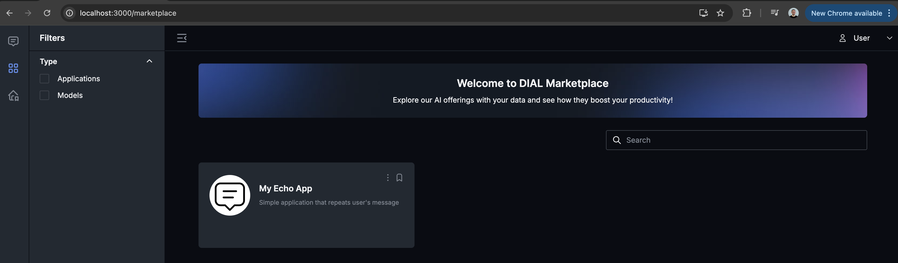
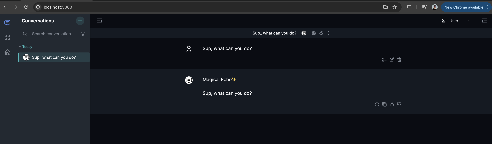

</details>

---

## 3. Add First LLM

**Without LLMs won't be possible to create AI-powered applications. You can add different LLMs to DIAL platform, let's add first one `gpt-4o` directly from https://api.openai.com/**

1. Add to [core/config.json](core/config.json) to **models** section:
    ```json
        "gpt-4o": {
          "displayName": "GPT 4o",
          "overrideName": "gpt-4o",
          "endpoint": "http://adapter-dial-openai:5000/openai/deployments/gpt-4o/chat/completions",
          "iconUrl": "http://localhost:3001/gpt4.svg",
          "type": "chat",
          "upstreams": [
            {
              "endpoint": "https://api.openai.com/v1/chat/completions",
              "key": "${YOUR_OPENAI_API_KEY}"
            }
          ]
        }
    ```
2. Replace `${YOUR_OPENAI_API_KEY}` with your OpenAI API Key. Here you create one, if you don't have 👉 https://platform.openai.com/api-keys
    > DIAL Core cannot work directly with different models, we have adapters for different vendors. 
    > In core configuration we have added the `endpoint` where the model will be accessible `http://adapter-dial-openai:5000/openai/deployments/gpt-4o/chat/completions` 
    > and you see that link is to `adapter-dial-openai:5000`, it is an adapter service that will need to add to [docker-compose](docker-compose.yml). 
    > In `upstreams` we provided routing endpoint, where requests from `http://adapter-dial-openai:5000/openai/deployments/gpt-4o/chat/completions` should go, 
    > and `key` is OpenAI API Key.
3. Add `ai-dial-adapter-openai` to [docker-compose](docker-compose.yml):
    ```yaml
      adapter-dial-openai:
        image: epam/ai-dial-adapter-openai:development
        # platform: linux/amd64
        environment:
          DIAL_URL: "http://core:8080"
          LOG_LEVEL: "INFO"
    ```
4. Restart whole docker compose
5. Test it In DIAL Chat
6. Test it with request from terminal
    ```
    curl --location 'http://localhost:8080/openai/deployments/gpt-4o/chat/completions?api-version=2024-08-06' \
    --header 'Api-Key: dial_api_key' \
    --header 'Content-Type: application/json' \
    --data '{
        "stream": false,
        "messages": [
            {
                "role": "user",
                "content": "hi"
            }
        ]
    }'
    ```

[More about DIAl OpenAI Adapter](https://github.com/epam/ai-dial-adapter-openai)

<details><summary>Result samples</summary>

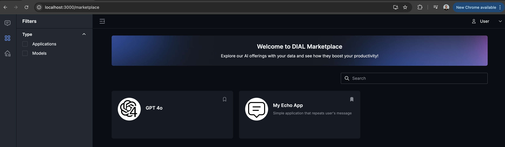
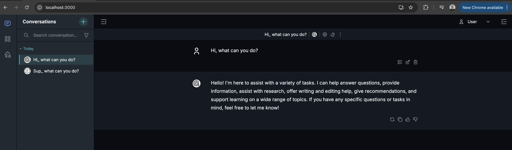

</details>

---

## 4. Add More LLMs from different vendors

### Anthropic

1. Add to [core/config.json](core/config.json) to **models** section:
    ```json
        "claude-sonnet-4": {
          "displayName": "Sonnet 4",
          "endpoint": "http://adapter-dial-bedrock:5000/openai/deployments/claude-sonnet-4-20250514/chat/completions",
          "type": "chat",
          "iconUrl": "http://localhost:3001/anthropic.svg",
          "upstreams": [
            {
              "key": "${YOUR_ANTHROPIC_API_KEY}"
            }
          ]
        }
    ```
2. Replace `${YOUR_ANTHROPIC_API_KEY}` with your Anthropic API Key. Here you create one, if you don't have 👉 https://console.anthropic.com/settings/keys
3. Add `ai-dial-adapter-bedrock` to [docker-compose](docker-compose.yml):
    ```yaml
      adapter-dial-bedrock:
        image: epam/ai-dial-adapter-bedrock:development
        # platform: linux/amd64
        environment:
          COMPATIBILITY_MAPPING: '{"claude-sonnet-4-20250514": "anthropic.claude-sonnet-4-20250514-v1:0"}'
          DIAL_URL: "http://core:8080"
          LOG_LEVEL: "DEBUG"
    ```
4. Restart whole docker compose
5. Test it In DIAL Chat
6. Test it with request from terminal
    ```
    curl --location 'http://localhost:8080/openai/deployments/claude-sonnet-4/chat/completions' \
    --header 'Api-Key: dial_api_key' \
    --header 'Content-Type: application/json' \
    --data '{
        "stream": false,
        "messages": [
            {
                "role": "user",
                "content": "hi"
            }
        ]
    }'
    ```

[More about DIAl Bedrock Adapter](https://github.com/epam/ai-dial-adapter-bedrock)

<details><summary>Result samples</summary>

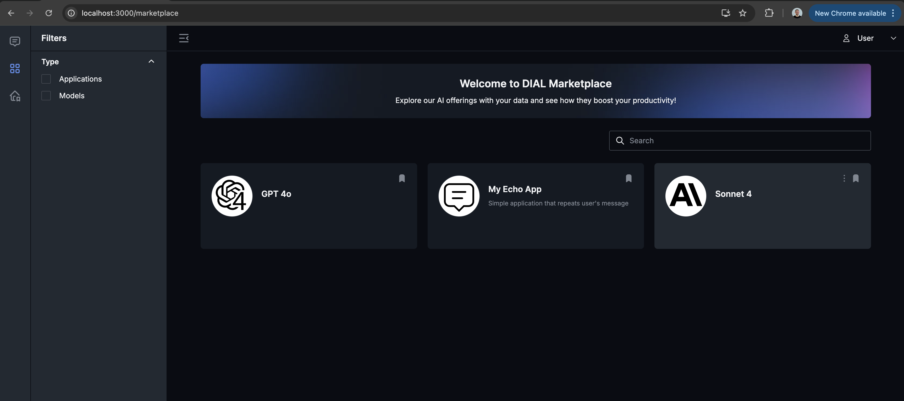
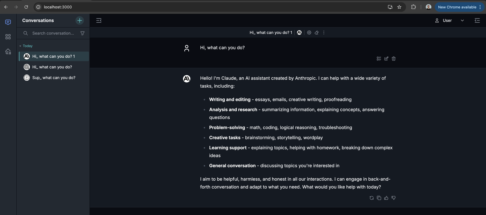

</details>

### Gemini
1. Add to [core/config.json](core/config.json) to **models** section:
    ```json
        "gemini-2.5-flash": {
          "displayName": "Gemini 2.5 Flash",
          "type": "chat",
          "endpoint": "http://adapter-dial-vertexai:5000/openai/deployments/gemini-2.5-flash/chat/completions",
          "iconUrl": "http://localhost:3001/Gemini-Pro-Vision.svg",
          "upstreams": [
            {
              "key": "${GEMINI_API_KEY}"
            }
          ]
        }
    ```
2. Replace `${GEMINI_API_KEY}` with your Gemini API Key. Here you create one, if you don't have 👉 https://aistudio.google.com/app/api-keys
3. Add `ai-dial-adapter-vertexai` to [docker-compose](docker-compose.yml):
    ```yaml
      adapter-dial-vertexai:
        image: epam/ai-dial-adapter-vertexai:development
        # platform: linux/amd64
        environment:
          DIAL_URL: "http://core:8080"
          LOG_LEVEL: "DEBUG"
    ```
4. Restart whole docker compose 
5. Test it In DIAL Chat
6. Test it with request from terminal
    ```
    curl --location 'http://localhost:8080/openai/deployments/gemini-2.5-flash/chat/completions' \
    --header 'Api-Key: dial_api_key' \
    --header 'Content-Type: application/json' \
    --data '{
        "stream": false,
        "messages": [
            {
                "role": "user",
                "content": "hi"
            }
        ]
    }'
    ```

[More about DIAl VertexAI Adapter](https://github.com/epam/ai-dial-adapter-bedrock)

<details><summary>Result samples</summary>

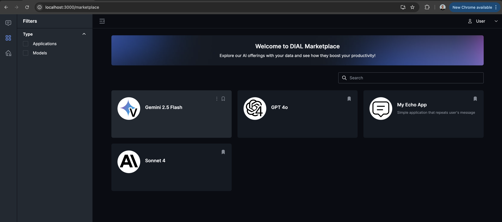
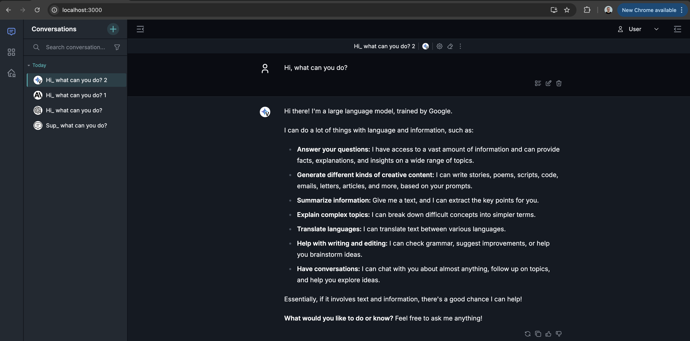

</details>

---

## 5. Add AI Essay Assistant

1. Add to [core/config.json](core/config.json) to **applications** section:
    ```json
        "essay-assistant": {
            "displayName": "Essay Assistant",
            "description": "Essay Assistant. Always answers with essay.",
            "endpoint": "http://host.docker.internal:5025/openai/deployments/essay-assistant-gpt/chat/completions"
        }
    ```
2. Open [app_gpt.py](app_demo/d2_essay_assistant/app_gpt.py) and run it.
3. Restart DIAL Core service
4. Open in browser [local DIAL Chat](http://localhost:3000/marketplace) and you should see there `Essay Assistant`
5. Test Essay Assistant app in DIAL Chat
6. Also, you can test it with request to Core:
    ```
    curl --location 'http://localhost:8080/openai/deployments/essay-assistant-gpt/chat/completions' \
    --header 'Api-Key: dial_api_key' \
    --header 'Content-Type: application/json' \
    --data '{
        "stream": false,
        "messages": [
            {
                "role": "user",
                "content": "About microwave"
            }
        ]
    }'
    ```

<details><summary>Result samples</summary>

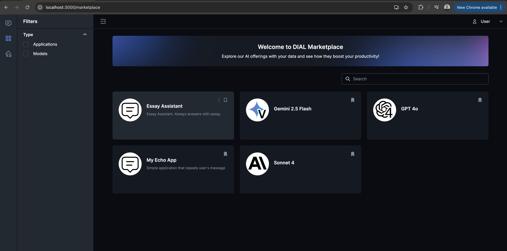
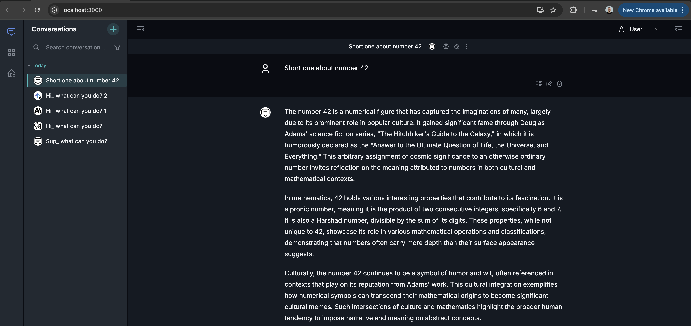

</details>

---

## 6. AI Essay Assistant With Sonnet

**DIAL is vendor-agnostic and provide you are free to use different models from different vendors without code change.** 

1. Add to [core/config.json](core/config.json) to **applications** section:
    ```json
        "essay-assistant-sonnet": {
          "displayName": "Essay Assistant Sonnet",
          "description": "Essay Assistant. Always answers with essay.",
          "endpoint": "http://host.docker.internal:5026/openai/deployments/essay-assistant-sonnet/chat/completions"
        }
    ```
2. Open [app_sonnet.py](app_demo/d2_essay_assistant/app_sonnet.py) and run it.
3. Restart DIAL Core service
4. Open in browser [local DIAL Chat](http://localhost:3000/marketplace) and you should see there `Essay Assistant Sonnet`
5. Test Essay Assistant Sonnet app

<details><summary>Result samples</summary>

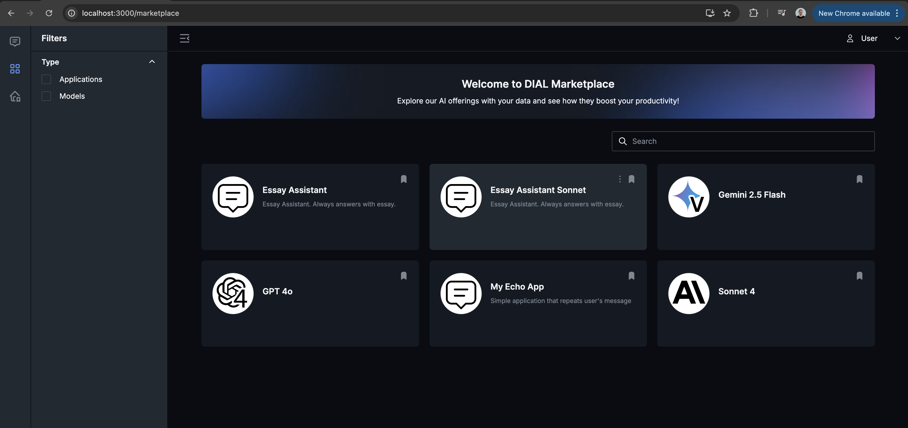
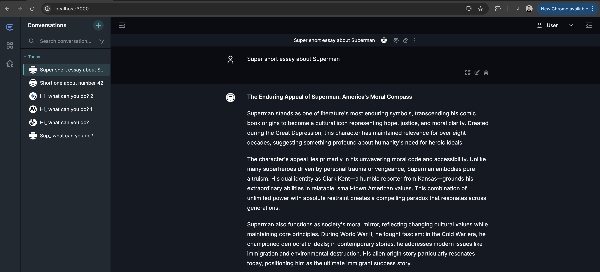

</details>

---

## 7. Merge Essay Assistants Into One App In Marketplace

**To have the same two applications with different Orchestration models seems inconvenient in marketplace. Instead, we can merge them into one:**

Replace `essay-assistant-gpt` and `essay-assistant-sonnet` apps configs with:
```json
    "essay-assistant-gpt": {
      "displayName": "Essay Assistant",
      "displayVersion": "gpt-4o",
      "description": "Essay Assistant. Always answers with essay.",
      "endpoint": "http://host.docker.internal:5025/openai/deployments/essay-assistant-gpt/chat/completions"
    },
    "essay-assistant-sonnet": {
      "displayName": "Essay Assistant",
      "displayVersion": "sonnet-4",
      "description": "Essay Assistant. Always answers with essay.",
      "endpoint": "http://host.docker.internal:5026/openai/deployments/essay-assistant-sonnet/chat/completions"
    }
```

What is changed:
- `displayName` for `essay-assistant-gpt` and `essay-assistant-sonnet` is the same `Essay Assistant`
- added `displayVersion` what will be shown as dropdown where user will be able to choose between `gpt-4o` and `sonnet-4` application version

<details><summary>Result samples</summary>

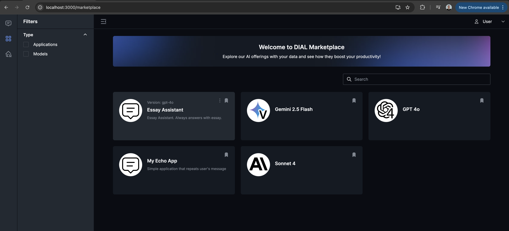
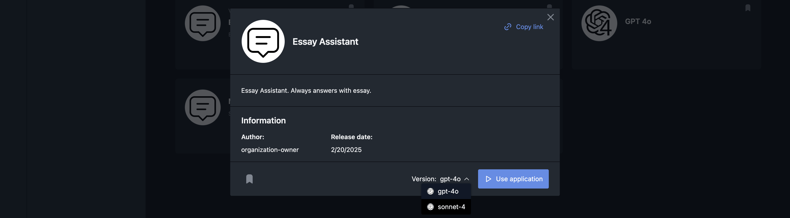
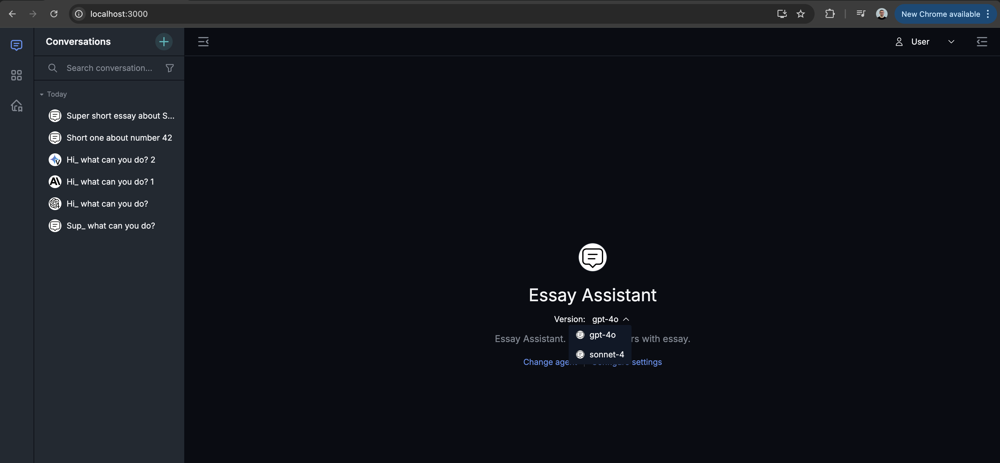

</details>

---

## 8. Add to AI Assistant start buttons

**In DIAL we are able to add buttons to our application**

To add start buttons is quite simple: 
1. Add to [essay_assistant.py](app_demo/d2_essay_assistant/essay_assistant.py) EssayAssistantApplication class such method:
    ```python
        async def configuration(self, request: ConfigurationRequest) -> Union[ConfigurationResponse, dict]:
            return {
                "type": "object",
                "properties": {
                    "conversation_starter_button": {
                        "description": "Conversation starters",
                        "type": "number",
                        "dial:widget": "buttons",
                        "oneOf": [
                            {
                                "const": 1,
                                "title": "About elephant in space",
                                "dial:widgetOptions": { "populateText": "Generate me one about elephant in space" }
                            },
                            {
                                "const": 2,
                                "title": "About dog that can sing",
                                "dial:widgetOptions": { "populateText": "Generate essay about dog that can sing" }
                            }
                        ]
                    }
                }
            }
    ```
2. Refactor the `essay` applications configurations, add to [core/config.json](core/config.json):
   - to `essay-assistant-gpt`
    ```json
    "features": {
        "configurationEndpoint": "http://host.docker.internal:5025/openai/deployments/essay-assistant-gpt/configuration"
    }
    ```
   - to `essay-assistant-sonnet`
    ```json
    "features": {
        "configurationEndpoint": "http://host.docker.internal:5026/openai/deployments/essay-assistant-sonnet/configuration"
    }
    ```
3. Start both [app_sonnet.py](app_demo/d2_essay_assistant/app_sonnet.py) and [app_gpt.py](app_demo/d2_essay_assistant/app_gpt.py). It is important since DIAL Core will fetch configurations from configuration endpoint
4. Restart DIAL Core service
5. Test it

[More about Conversation starter buttons](https://docs.dialx.ai/tutorials/developers/apps-development/custom-buttons#populate-button)

<details><summary>Sample</summary>

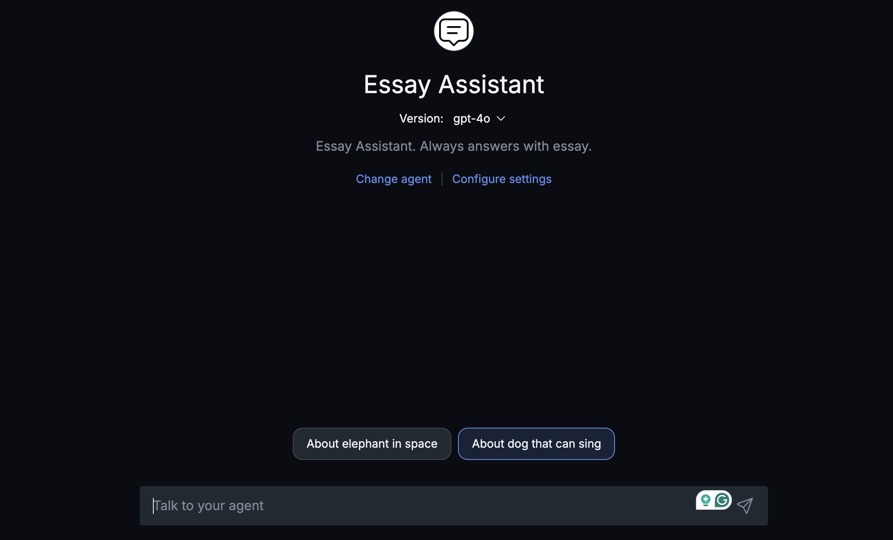

</details>

---

## 9. Button-Driven Application

In production-ready applications we sometimes need to get some confirmations from the user (human in the loop). DIAL 
supports different buttons for this. You even can make some predefined flow with steps.

[About DIAL Buttons](https://docs.dialx.ai/tutorials/developers/apps-development/custom-buttons)

1. Add to [core/config.json](core/config.json) to **applications** section:
    ```json
    "buttons-sample": {
          "displayName": "Button-Driven Application",
          "description": "Demonstrates DIAL buttons capabilities",
          "endpoint": "http://host.docker.internal:5027/openai/deployments/buttons-sample/chat/completions",
          "features": {
            "configurationEndpoint": "http://host.docker.internal:5027/openai/deployments/buttons-sample/configuration"
          }
        }
    ```
2. Open [button_driven_conversation.py](app_demo/d3_buttons/button_driven_conversation.py) and run it.
3. Restart DIAL Core service
4. Open in browser [local DIAL Chat](http://localhost:3000/marketplace) and you should see there `Button-Driven Application`
5. Test Button-Driven Application

<details><summary>Result samples</summary>

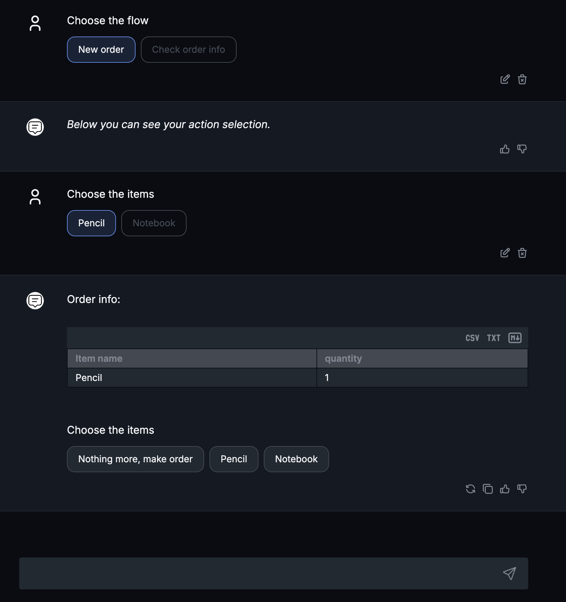
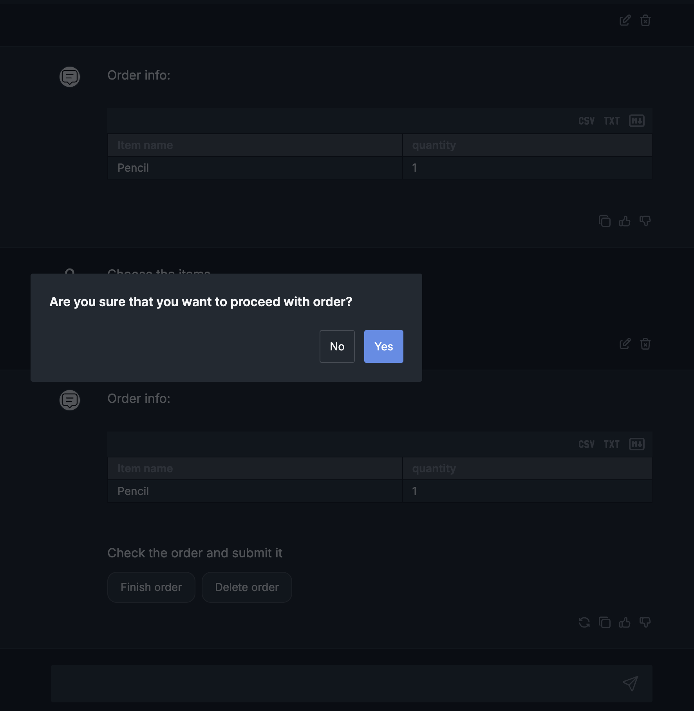

</details>

---

## 10. Add Embedding model

DIAL Supports not only LLMs but mary different types of models, such as Embedding, Image Gen, STT (Speech-To-Text), TTS (Text-To-Speech) and Video Gen models.

Let's add Embedding model:
1. Add to [core/config.json](core/config.json) to **models** section:
    ```json
        "text-embedding-3-large": {
          "type": "embedding",
          "overrideName": "text-embedding-3-large",
          "endpoint": "http://adapter-dial-openai:5000/openai/deployments/text-embedding-3-large/embeddings",
          "upstreams": [
            {
              "endpoint": "https://api.openai.com/v1/embeddings",
              "key": "${OPENAI_API_KEY}"
            }
          ]
        }
    ```
2. Replace `${YOUR_OPENAI_API_KEY}` with your OpenAI API Key.
3. Restart DIAL Core service
4. Test it:
    ```
    curl --location 'http://localhost:8080/openai/deployments/text-embedding-3-large/embeddings?api-version=2024-02-01' \
    --header 'Api-Key: dial_api_key' \
    --header 'Content-Type: application/json' \
    --data '{
        "input": "hello",
        "dimensions": 10
    }'
    ```
<details><summary>Result sample</summary>

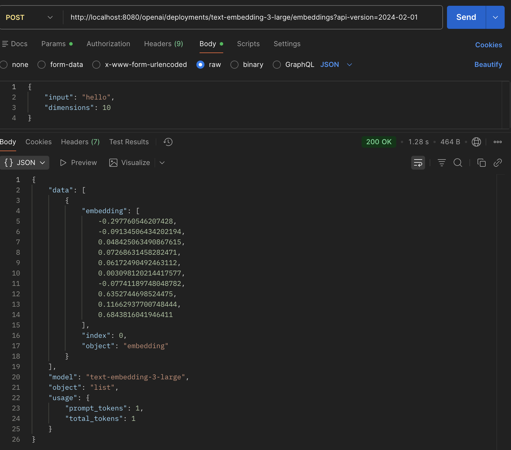

</details>

---

## 11. Add Custom RAG

Now, let's use `text-embedding-3-large` and create simple Microwave RAG application, that will index [microwave_manual.txt](app_demo/d4_custom_rag/microwave_manual.txt) and will be able to answer to user questions.

1. Add to [core/config.json](core/config.json) to **applications** section:
    ```json
        "microwave-rag": {
          "displayName": "Microwave RAG App",
          "description": "Simple RAG App to work with microwave manual",
          "endpoint": "http://host.docker.internal:5028/openai/deployments/microwave-rag/chat/completions"
        }
    ```
2. Open [microwave_rag_app.py](app_demo/d4_custom_rag/microwave_rag_app.py) and run it.
3. Restart DIAL Core service
4. Test Microwave RAG App
    ```
    What are the steps to set the clock time on the DW 395 HCG microwave oven?
    ```
    ```
    What is the ECO function on this microwave and how do you activate it?
    ```
    ```
    What are the specifications for proper installation, including the required free space around the oven?
    ```
    ```
    How does the multi-stage cooking feature work, and what types of cooking programs cannot be included in it?
    ```

<details><summary>Result samples</summary>

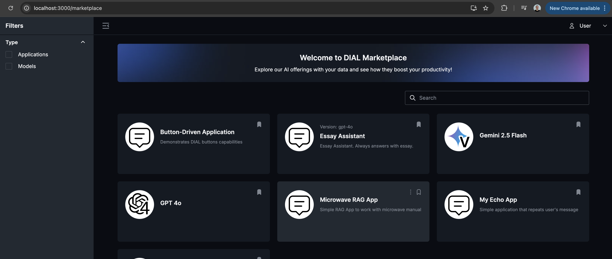
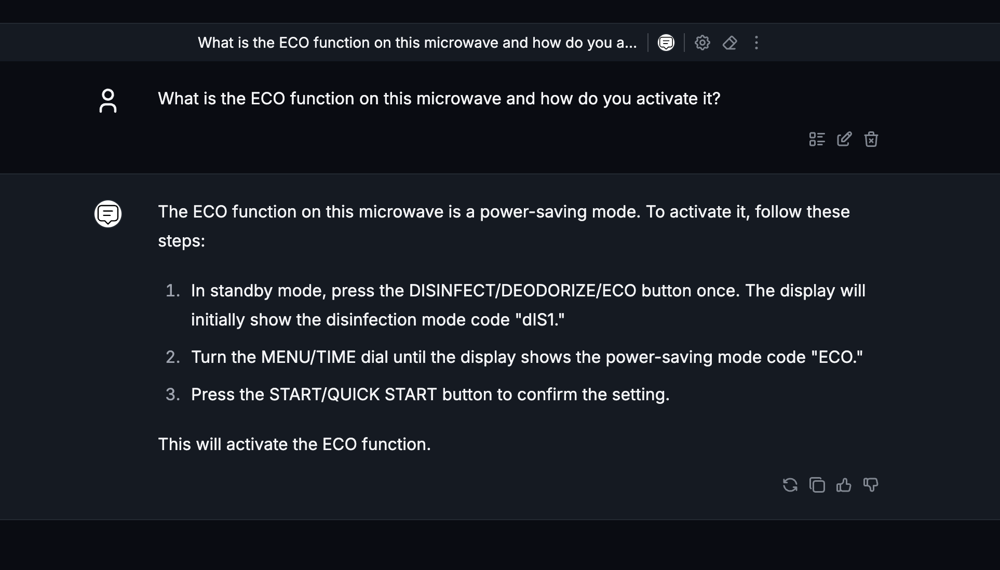

</details>

---

## 12. Add DIAL RAG

DIAL has its own powerful universal [DIAL RAG application](https://github.com/epam/ai-dial-rag). Let's simply add it and test:

1. Add to [core/config.json](core/config.json) to **applications** section:
    ```json
        "dial-rag": {
          "displayName": "DIAL RAG",
          "description": "The Dial RAG answers user questions using information from the documents provided by user. It supports the following document formats: PDF, DOC/DOCX, PPT/PPTX, TXT and other plain text formats such as code files. Also, it supports PDF and JPEG, PNG and other image formats for the image understanding.",
          "endpoint": "http://dial-rag:5000/openai/deployments/dial-rag/chat/completions",
          "inputAttachmentTypes": [
            "application/pdf",
            "application/msword",
            "application/vnd.openxmlformats-officedocument.wordprocessingml.document",
            "application/vnd.ms-powerpoint",
            "application/vnd.openxmlformats-officedocument.presentationml.presentation",
            "text/plain",
            "image/jpeg",
            "image/png"
          ]
        }
    ```
2. Add `dial-rag` to [docker-compose](docker-compose.yml):
```yaml
  dial-rag:
    image: epam/ai-dial-rag:development
    #platform: linux/amd64
    environment:
      DIAL_URL: http://core:8080
      DIAL_API_KEY: dial_api_key
      DIAL_RAG_URL: ${DIAL_RAG_URL:-http://host.docker.internal:5000}
      DIAL_RAG__CONFIG_PATH: /app/config/embedding.yaml
    volumes:
      - ./dial-rag/embedding.yaml:/app/config/embedding.yaml:ro
```
3. Restart whole docker compose
4. Test DIAL RAG with [microwave_manual.txt](app_demo/d4_custom_rag/microwave_manual.txt) (or any other file). The file will be indexed once and will 
    ```
    What are the steps to set the clock time on the DW 395 HCG microwave oven?
    ```
    ```
    What is the ECO function on this microwave and how do you activate it?
    ```
    ```
    What are the specifications for proper installation, including the required free space around the oven?
    ```
    ```
    How does the multi-stage cooking feature work, and what types of cooking programs cannot be included in it?
    ```

<details><summary>Result samples</summary>

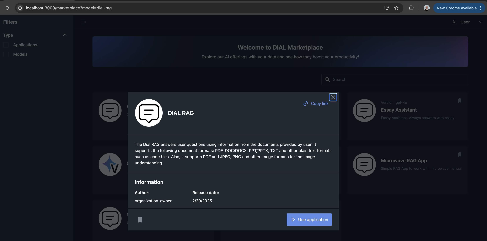
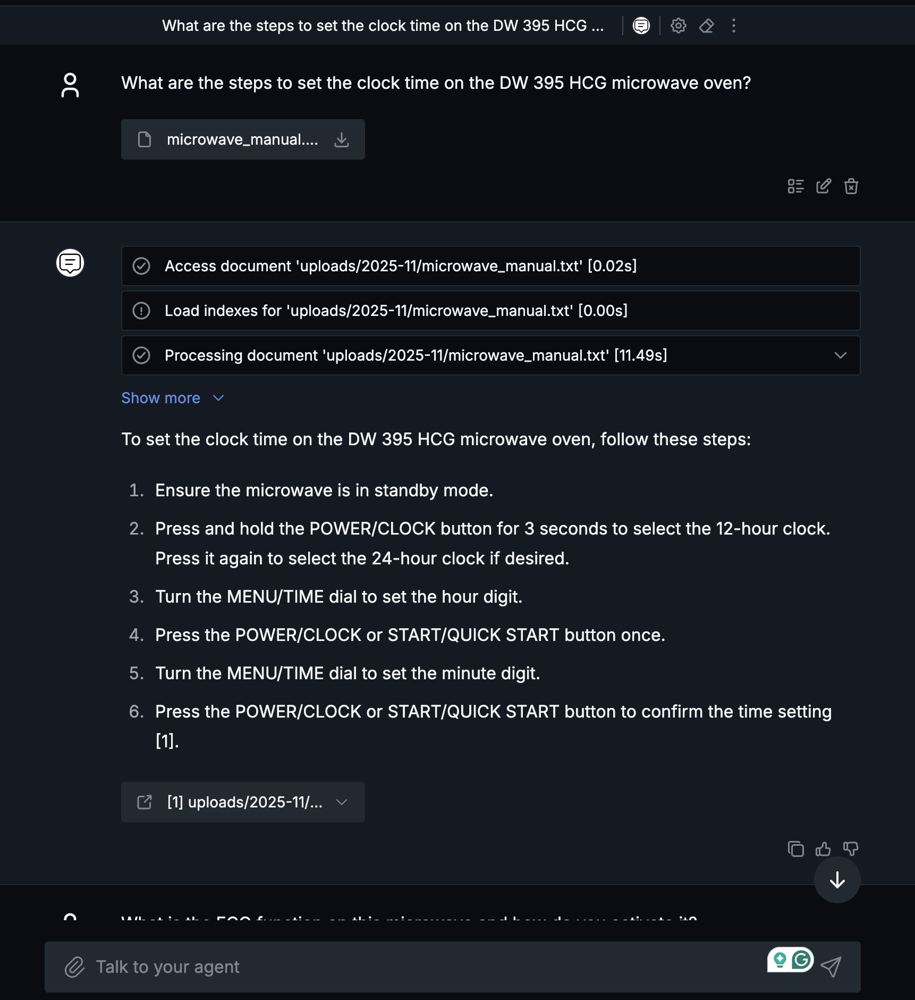

</details>

---

## DON'T FORGET TO DELETE API KEYS BEFORE PUSH